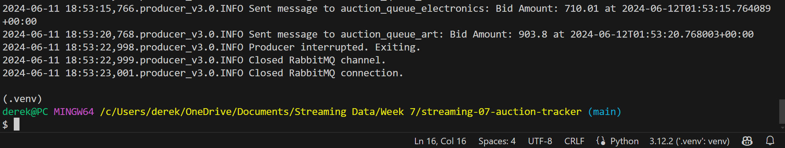

# streaming-07-auction-tracker

This project is a real-time auction tracking system using RabbitMQ to stream, process, and analyze bid data. It generates synthetic bid messages and processes them to simulate a live auction environment using custom producer and consumer scripts.

## Repository Structure

- **producer_v1.0.py**: Generates and sends synthetic bid messages to a single queue.
- **consumer_v1.0.py**: Reads and logs messages from a single queue.
- **producer_v2.0.py**: Enhanced to send messages to multiple queues based on item type.
- **consumer_v2.0.py**: Enhanced to read from multiple queues and log messages based on item type.
- **producer_v3.0.py**: Continuously sends messages with an open RabbitMQ connection.
- **consumer_v3.0.py**: Maintains a rolling window of bids from multiple queues.
- **consumer_v4.0.py**: Reads messages from multiple queues, maintains a rolling window, and sends email alerts for high bids.  
- **emailer.py**: Script to send email alerts. (Only used with consumer_v4.0 in this project)
- **.env.toml**: Configuration file for storing email credentials and "secrets" (only used with consumer_v4.0 and not included in version control).
- **util_logger.py**: Sets up logging for the project.
- **README.md**: Project documentation (this file).

## Project Goals

- **Stream Live Bid Data**: Handle bid data in real-time.
- **Simulate Bidding**: Use synthetic data to mimic an auction scenario.
- **Implement RabbitMQ**: Use RabbitMQ for message queuing.
- **Logging and Monitoring**: Use logging for visibility and debugging.
- **Email Alerts**: Send email alerts for high bids.

## Data Sources

- **Faker Library**: Generates realistic auction data including bidder details and bid amounts.
- **Custom Data Handling**: Simulate both good and bad data to demonstrate error handling.

## Dependencies

- Python
- pika: For RabbitMQ integration
- faker: Generates synthetic data
- json: Handling JSON data
- random: Generates random values
- datetime: Handles dates and times
- tomllib: Reading TOML files for email configuration (requires Python 3.11+)
- email: Handy EmailMessage class
- smtplib: For transmission via SMTP

## Project Setup

### 1. Prerequisites

- Python: Ensure you have Python 3.10 or later installed.
- RabbitMQ: Ensure RabbitMQ is installed and running on localhost. Visit [RabbitMQ Admin Interface](http://localhost:15672).

### 2. Clone the Repository

Start a new repository and copy the files, or clone the repository to your local machine:
```bash
git clone https://github.com/your-username/streaming-07-auction-tracker.git
cd streaming-07-auction-tracker
```
### 3. Setting up Virtual Environment
- Create virtual environment: 
```bash
python -m venv .venv
```
- Activate the virtual environment:
```bash
source .venv/scripts/activate
```
### 4. Install Dependencies

```bash
pip install pika faker
```
- Generate requirements.txt for dependency tracking:
```bash
pip freeze > requirements.txt
```

### 5.  Update .gitignore file with environment and .env.toml to leave these out of version control:
```bash
echo ".venv/" >> .gitignore
echo ".env.toml" >> .gitignore
```
or simply add .venv and .env.toml into the .gitignore file. 

## Running the Project
Step-by-Step Execution Guide

Version 1.0

1. Run Producer v1.0
- In your terminal, ensure you are in the project directory and the virtual environment is activated. Then, run the producer script:

```bash
python producer_v1.0.py
```

Expected output from console:

```bash
Would you like to monitor RabbitMQ queues? (y/n): y
Opened RabbitMQ Admin site.
Sent message: {'bidder_id': '...', 'bid_amount': ..., 'timestamp': '...', 'item': '...', 'bidder_name': '...', 'bidder_email': '...'}
Closed RabbitMQ connection
```
A log file will also be generated with the message details in logs/producer_v1.0.log.

2. Run Consumer v1.0 in a separate terminal
- In a separate terminal, navigate to the project directory, activate the virtual environment, and run the consumer script:

```bash
python consumer_v1.0.py
```

Expected output from console:

```bash
Starting consumer. Waiting for messages...
Received message: {'bidder_id': '...', 'bid_amount': ..., 'timestamp': '...', 'item': '...', 'bidder_name': '...', 'bidder_email': '...'}
```
A log file will also be generated when running the consumer in 'logs/consumer_v1.0.log'.

Version 2.0

1. Run Producer v2.0
- Sends messages to multiple queues based on item type.

```bash
python producer_v2.0.py
```

Expected console output:
```bash
Would you like to monitor RabbitMQ queues? (y/n): y
Opened RabbitMQ Admin site.
Sent message to auction_queue_electronics: {'bidder_id': '...', 'bid_amount': ..., 'timestamp': '...', 'item': 'electronics', 'bidder_name': '...', 'bidder_email': '...'}
```
A log file will also be generated in logs/producer_v2.0.log.

2. Run Consumer v2.0 in a separate console
- Reads from multiple queues and logs messages based on item type.

```bash
python consumer_v2.0.py
```

Expected console output:

```bash
Starting consumer. Waiting for messages...
Received electronics message: {'bidder_id': '...', 'bid_amount': ..., 'timestamp': '...', 'item': 'electronics', 'bidder_name': '...', 'bidder_email': '...'}
```
A log file will also be generated in logs/consumer_v2.0.log.

Version 3.0

1. Run Producer v3.0
- Continuously sends bid messages to multiple RabbitMQ queues with an open connection and improved logging.

```bash
python producer_v3.0.py
```

Expected console output:

```bash
Would you like to monitor RabbitMQ queues? (y/n): y
Opened RabbitMQ Admin site.
Producer started. Sending messages to RabbitMQ queues.
Sent message to auction_queue_electronics: Bid Amount: ... at ...
```

A log file will also be generated in logs/producer_v3.0.log.

2. Run Consumer v3.0
- Reads bid messages from multiple RabbitMQ queues and maintains a rolling window of bids.

```bash
python consumer_v3.0.py
```

Expected console output:

```bash
Starting consumer. Waiting for messages...
Received electronics message: Bid Amount: ... at ...
Rolling window for electronics updated. Size: ..., Latest bid: ... at ...
```
A log file will also be generated in logs/consumer_v3.0.log.

Version 4.0 (Consumer only- will still use producer_v3.0.py)

1. Run Producer v3.0

- Use producer_v3.0.py as it already supports continuous messaging with an open connection.

2. Run Consumer v4.0
- Reads messages from multiple RabbitMQ queues, maintains a rolling window, and sends email alerts for high bids using configuration settings from .env.toml and emailer.py.

```bash
python consumer_v4.0.py
```

Expected console output:

```bash
Starting consumer. Waiting for messages...
Received art message: 931.43 at 2024-06-12T03:57:06.441262+00:00
Rolling window for art updated. Size: 5, Latest bid: 931.43 at 2024-06-12T03:57:06.441262+00:00
High bid alert: 931.43 at 2024-06-12T03:57:06.441262+00:00. Sending email alert.
========================================
Prepared Email Message:
========================================

From: ttesterson397@gmail.com
To: ttesterson397@gmail.com
Reply-to: ttesterson397@gmail.com
Subject: High Bid Alert: Art - $931.43
Content-Type: text/plain; charset="utf-8"
Content-Transfer-Encoding: 7bit
MIME-Version: 1.0

A high bid of $931.43 was placed on art at 2024-06-12T03:57:06.441262+00:00.

========================================
SMTP server created: <smtplib.SMTP object at 0x000001FFF78E8380>
========================================
TLS started. Will attempt to login.
Successfully logged in as ttesterson397@gmail.com.
Message sent.
Session terminated.
========================================
```

### Simulated Run

Follow these steps to simulate a complete run of the auction tracker system:

1. **Start RabbitMQ**: Ensure RabbitMQ server is running. This can usually be done by starting the RabbitMQ service on your machine. Verify by navigating to [RabbitMQ Admin Interface](http://localhost:15672) in your browser.

2. **Run Producer**: Open a terminal and execute the producer script. This will continuously generate and send bid messages to RabbitMQ queues.
   
```bash
python producer_v1.0.py  
```
- If using producer_v1.0.py, it will send a single message and close the connection.
- If using producer_v2.0.py or producer_v3.0.py, it will continuously send messages at intervals until you manually stop it (ctrl+c in terminal).
- When prompted in terminal, type in y and hit enter to open RabbitMQ Admin and monitor the queue status.

3. **Run Consumer**: Open another terminal and execute the consumer script. This will read and log messages from the RabbitMQ queues and maintain a rolling window if using consumer_v3.0.py or consumer_v4.0.py.

```bash
python consumer_v1.0.py
```
- consumer_v1.0.py: will process and log each received message.
- consumer_v2.0.py: reads from multiple queues and logs messages based on item type.
- consumer_v3.0.py: will update a rolling window of the last few bids and log updates.
- consumer_v4.0.py: Will update a rolling window and send email alerts for high bids.

- NOTE that ALL consumers must be deactivated manually (using ctrl+c in terminal), otherwise, they will continue to listen for messages. 

4. **Verify**:
- Queue Status: Check the status of your queues in the RabbitMQ admin interface. Ensure that messages are being sent and recieved as expected.

- Logs: Review the logs generated by both producer and consumer scripts to confirm successful message handling.

- Email Alerts: Check your email inbox for alerts if using consumer_v4.0.py.

## Screenshots

Version 1 Outputs:
- 
- 

Version 2 Outputs:
- 
- 

Version 3 Outputs:
- 
- 

Version 4 Outputs:
- 
- 

RabbitMQ Admin:
- 
- 
- 
- .png)
- 
Logging Examples:
- 
- 

Close Connection Terminal:
- 

## Sources

- **Instructor Repositories**
  - [Producer with Multiple Consumers](https://github.com/denisecase/streaming-04-multiple-consumers)

- **RabbitMQ**
  - [RabbitMQ Official Documentation](https://www.rabbitmq.com/documentation.html)

- **Faker Library**: 
  - [Faker Library Documentation](https://faker.readthedocs.io/en/master/)

- **pika**: 
  - [Pika Documentation](https://pika.readthedocs.io/en/stable/)

- **smtplib**
  - [smtplib Documentation](https://docs.python.org/3/library/smtplib.html)

- **collections.deque**
  - [deque class Documentation](https://docs.python.org/3/library/collections.html#collections.deque)

- **json**
  - [JSON Module Documentation](https://docs.python.org/3/library/json.html)

- **random**
  - [Random Module Documentation](https://docs.python.org/3/library/random.html)

- **datetime**
  - [Datetime Module Documentation](https://docs.python.org/3/library/datetime.html)

- **venv**
  - [Python Virtual Environments Documentation](https://docs.python.org/3/library/venv.html)

- **tomllib**
  - [tomllib Documentation](https://docs.python.org/3/library/tomllib.html)

- **Email and Security**
  - [Setting Up Gmail for Sending Emails](https://support.google.com/mail/answer/7126229?hl=en)
  - [Creating App Passwords](https://support.google.com/accounts/answer/185833?hl=en)

- **Real-Time Data Streaming and Processing**
  - [Real-Time Messaging with RabbitMQ](https://www.rabbitmq.com/tutorials/tutorial-one-python.html)
